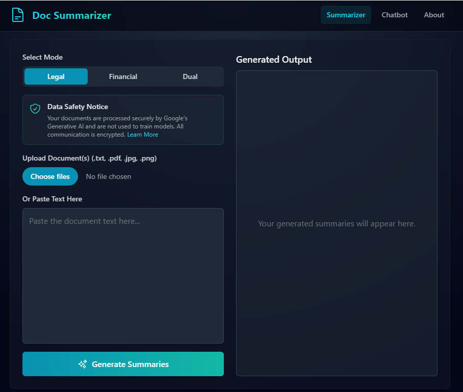

# Intelligent Document Summarizer

A modern web app that uses AI to generate clear, accurate summaries of legal and financial documents. Powered by Google Gemini 2.5 Flash and built with React and Tailwind CSS.

## Features

- Summarize uploaded documents (PDF, TXT, JPG, PNG) or pasted text
- Specialized modes for Legal, Financial, or Dual analysis
- Chatbot assistant for follow-up questions
- Extractive and Abstractive summaries, plus key points
- Clean, responsive dark theme design
- Secure file processing and data safety notice

## Demo

# Run and deploy your AI Studio app

This contains everything you need to run your app locally.

View your app in AI Studio: https://ai.studio/apps/drive/10DbqYsB-A9NeFaqs9f2sRjMRVJVkAL_9

## Run Locally

**Prerequisites:**  Node.js

1. Install dependencies:
   `npm install`
2. Set the `GEMINI_API_KEY` in [.env.local](.env.local) to your Gemini API key
3. Run the app:
   `npm run dev`

## Technologies Used

-   **React** - A JavaScript library for building user interfaces.
-   **TypeScript** - A typed superset of JavaScript that compiles to plain JavaScript.
-   **Tailwind CSS** - A utility-first CSS framework for rapid UI development.
-   **Google Gemini 2.5 Flash** (via `@google/genai`) - The AI model powering text extraction, summarization, and chat.
-   **jsPDF** - For client-side PDF generation.

## Security & Privacy

Your documents are processed securely. Files are sent directly to Google's Generative AI API and are **not** used for model training or stored on any intermediary servers. All communications are encrypted.
